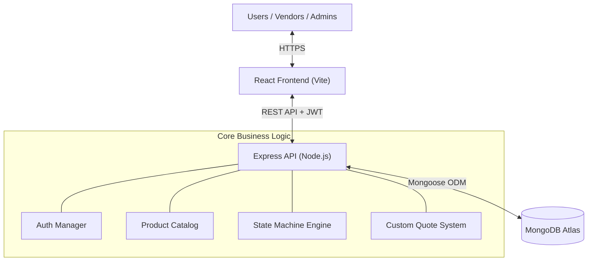

# Evently: Modern Event Services Marketplace

**A comprehensive MERN stack platform for event planning and vendor management.**

Evently connects event organizers with service providers (Catering, Decor, Photography, etc.) through a streamlined, role-based ecosystem. Designed with professional scalability in mind, it features a custom order state machine, secure JWT-based authentication, and a sleek, responsive interface.

---

## 🚀 Professional Highlights

### For Interviewers & Recruiters
- **Strict Specification Compliance**: Built to align with a rigorous **22-screen design specification**, ensuring pixel-perfect layout and comprehensive user flow coverage.
- **Robust State Management**: Implements an explicit **Order State Machine** (`server/src/lib/orderState.js`) to handle complex service transitions (Placed → Accepted/Rejected → Out for Delivery → Delivered).
- **Security-First Architecture**: 
  - Centralized JWT authentication with role-based access control (RBAC).
  - Server-side price enforcement (ignores client-side price injections).
  - Sensitive data protection: Passwords are automatically stripped at the database layer (Mongoose `toJSON` transforms).
- **Developer Experience**: Includes a built-in **Navigation Aid (Link Chart)** to track feature implementation against the 22-screen project requirement.

---

## 🛠️ Tech Stack

| Layer | Technology | Key Features |
|---|---|---|
| **Frontend** | React 18 + Vite | Fast HMR, optimized production builds |
| **Logic** | React Router v6 | Sophisticated route guarding & nested layouts |
| **Styling** | Vanilla CSS + Design Tokens | Custom, lightweight design system |
| **Validation** | Zod + React Hook Form | Type-safe form handling and schema validation |
| **Backend** | Node.js + Express | RESTful API architecture |
| **Database** | MongoDB + Mongoose 8 | ODM with strict schema validation & relationship mapping |
| **Auth** | JWT + bcryptjs | Secure, stateless authentication flow |
| **Deployment** | Vercel (Client), Render (Server) | CI/CD optimized pipelines |

---

## 🏗️ Architecture



### Order Workflow (State Machine)
```text
          ┌────────────┐
          │  placed    │  (Initial state)
          └──┬─────┬───┘
       ┌────┘     └────┐
       ▼               ▼
  ┌──────────┐    ┌──────────┐
  │ accepted │    │ rejected │  (Terminal)
  └──┬────┬──┘    └──────────┘
     │    └──────────────┐
     ▼                   ▼
┌──────────────────┐  ┌──────────┐
│ out_for_delivery │  │ rejected │
└────┬─────────────┘  └──────────┘
     ▼
  ┌───────────┐
  │ delivered │  (Terminal)
  └───────────┘
```

---

## 📋 Features

### 👤 For Users (Customers)
- **Vendor Discovery**: Browse services by category or search term.
- **Detailed Planning**: View comprehensive vendor profiles and product details.
- **Dynamic Cart**: Manage multiple items with real-time total calculations.
- **Order Tracking**: Monitor service status through professional milestones.
- **Custom Requests**: Request non-standard services via the "Custom Quote" flow.

### 🏪 For Vendors (Service Providers)
- **Profile Management**: Manage business availability and contact info.
- **Catalog Control**: Full CRUD for services/products.
- **Order Fulfillment**: Interactive dashboard to process incoming orders.
- **Response System**: Manage custom service inquiries and provide quotes.

### 🛡️ For Administrators
- **KPI Dashboard**: Real-time stats on marketplace volume and user activity.
- **User Governance**: Activate/Deactivate user and vendor accounts.
- **Global Visibility**: Monitor all transactions across the entire platform.

---

## 💻 Local Setup

### 1. Requirements
- Node.js (v18+)
- MongoDB Atlas account or local MongoDB instance

### 2. Installation
```bash
# Clone the repository
git clone https://github.com/VedangSaiRath/evently.git
cd evently

# Install all dependencies (Root, Client, and Server)
npm run install:all

# Setup Environment Variables
cp server/.env.example server/.env
cp client/.env.example client/.env
```

### 3. Database Initialization
```bash
# This wipes the DB and seeds it with professional demo data
npm run seed
```

### 4. Launch
```bash
# Start Backend (Port 5000)
npm run dev:server

# Start Frontend (Port 5173)
npm run dev:client
```

---

## 🔐 Credentials (Demo)

Use these accounts after seeding to explore the different platform roles:

| Role | Email | Password |
|---|---|---|
| **Admin** | `admin@evently.dev` | `ChangeMe#2026` |
| **Vendor** | `catering@evently.dev` | `Vendor#2026` |
| **User** | `anita@evently.dev` | `User#2026` |

---

## 📝 Author

**Vedang Sai Rath**
*B.Tech in Electronics and Communication Engineering*
Guru Tegh Bahadur Institute of Technology (GGSIPU), 2026

[LinkedIn](https://linkedin.com/in/vedang-sai-rath) · [GitHub](https://github.com/VedangSaiRath) · [Portfolio](#)

---

> **Developer Note:** This project includes a "Navigation Aid" tool accessible via the floating icon in the bottom-right corner during development. This was used to ensure strict compliance with the 22-screen design specification.
